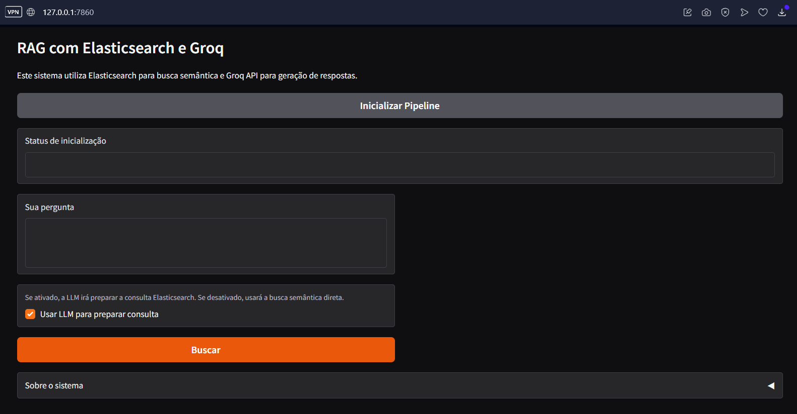
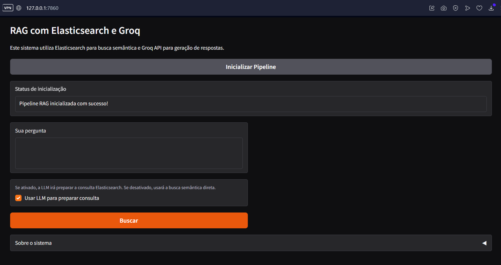
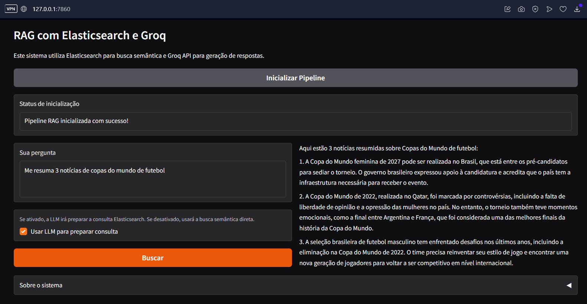
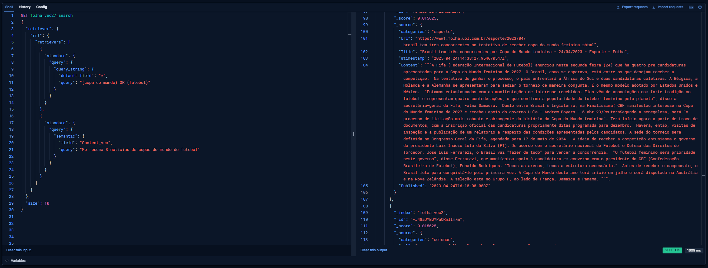
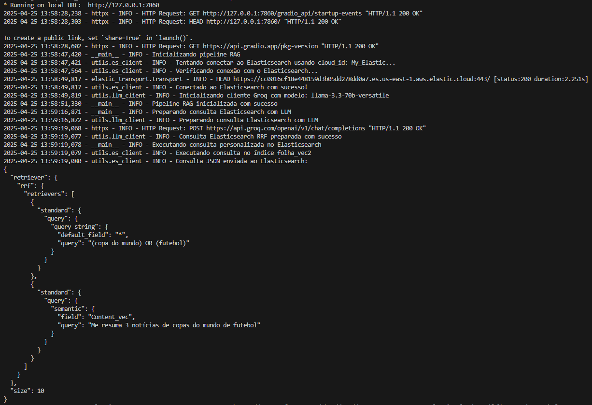

# RAG com Elasticsearch e Groq

Este projeto implementa uma arquitetura RAG (Retrieval-Augmented Generation) utilizando Elasticsearch para busca semântica e a API do Groq para geração de respostas.

## Arquitetura

O sistema funciona da seguinte forma:
1. O usuário envia uma pergunta através do chatbot
2. A LLM (via API Groq) transforma a pergunta em uma consulta híbrida para o Elasticsearch
3. O Elasticsearch realiza a busca semântica utilizando sua capacidade nativa de vetorização
4. Os documentos mais relevantes são recuperados
5. A LLM gera uma resposta contextualizada com base nos documentos encontrados

## Estrutura do Projeto

```
├── app.py             # Aplicação principal com interface Gradio
├── config.py          # Configurações (ES, LLM, etc.)
├── .env.example       # Exemplo de variáveis de ambiente
├── requirements.txt   # Dependências
└── utils/
    ├── __init__.py
    ├── es_client.py   # Cliente Elasticsearch
    └── llm_client.py  # Cliente LLM (Groq)
```

## Pré-requisitos

- Python 3.8+
- Acesso a um cluster Elasticsearch com índice que contém campo semantic_text vetorizado (8.15+)

### Sobre o índice utilizado

O índice utilizado para as buscas semânticas foi construído a partir de uma base de dados de notícias da Folha de São Paulo. Esse dataset está disponível publicamente no Kaggle: [Folha News of the Brazilian Newspaper 2024](https://www.kaggle.com/datasets/luisfcaldeira/folha-news-of-the-brazilian-newspaper-2024). O índice foi preparado para conter campos textuais (título, conteúdo, etc.) e campos vetorizados para buscas semânticas. Isso permite que perguntas abertas sejam respondidas com base em similaridade de contexto, e não apenas por palavras-chave exatas.

A estrutura do índice foi adaptada para suportar buscas híbridas (texto + vetor), aproveitando ao máximo as capacidades do Elasticsearch 8.15+.

Além disso, foi criado um campo vetorial chamado `Content_vec` no índice, a partir do campo de texto `Content`. Esse campo foi vetorizado utilizando o modelo built-in da Elastic chamado `.multilingual-e5-small-elasticsearch`, permitindo buscas semânticas avançadas diretamente no Elasticsearch. Dessa forma, perguntas em linguagem natural podem ser comparadas semanticamente ao conteúdo das notícias, aumentando a precisão das respostas.

Um dos grandes diferenciais do tipo `semantic_text` do Elasticsearch é sua capacidade de realizar automaticamente o "chunking" do texto — ou seja, dividir textos longos em partes menores, respeitando o limite máximo de tokens do modelo de embedding utilizado. Antes do advento do campo `semantic_text`, era necessário implementar esse processo de chunking externamente, fragmentando manualmente os textos para garantir que cada pedaço estivesse dentro do limite aceito pelo modelo de vetorização. Agora, ao utilizar o `semantic_text`, o Elasticsearch faz essa divisão de forma nativa e transparente, simplificando o pipeline de ingestão e garantindo melhor aproveitamento do modelo, além de facilitar a indexação de documentos extensos.

- Chave de API do Groq

## Configuração

1. Clone este repositório
2. Instale as dependências:
   ```
   pip install -r requirements.txt
   ```
3. Crie um arquivo `.env` na raiz do projeto com as seguintes variáveis:
   ```
   # Elasticsearch
   ES_CLOUD_ID=seu_cloud_id # caso esteja utilizando elastic on-prem, alterar para host e porta
   ES_API_KEY=sua_chave_api_elasticsearch
   ES_INDEX=nome_do_indice
   ES_TEXT_FIELD=texto # campo de texto principal
   ES_SEMANTIC_FIELD=semantic_text # campo vetorizado
   ES_TIMEOUT=30
   ES_MAX_RESULTS=5
   
   # Groq API
   GROQ_API_KEY=sua_chave_api_groq
   LLM_MODEL=llama-3.3-70b-versatile
   LLM_TEMPERATURE=1
   ```

## Uso

Execute a aplicação com:
```
python app.py
```

Para este exemplo, foi utilizada uma base de dados de notícias da Folha de São Paulo. Esse dataset foi retirado do kaggle, e pode ser encontrado em: https://www.kaggle.com/datasets/luisfcaldeira/folha-news-of-the-brazilian-newspaper-2024.

A interface web será iniciada localmente:



Para testar:
1. Clicar em "Inicializar Pipeline" para conectar ao Elasticsearch e preparar o sistema



2. Digitar sua pergunta e clicar em "Buscar"



3. Opcionalmente, ativar/desativar a opção:
   - "Usar LLM para preparar consulta" para alternar entre consulta personalizada pela LLM ou busca semântica direta (desabilitar a opção fará com que todas as palavras contidas na busca sejam pesquisadas no índice, com a remoção de stopwords, apenas)

4. A consulta também foi validada no Kibana para analisar o output da consulta



5. Nos logs, é possível ver a mesma consulta sendo criada pela LLM e enviada para o Elasticsearch



## Detalhes sobre a consulta RRF (Reciprocal Rank Fusion)

Este projeto utiliza a técnica de *Reciprocal Rank Fusion* (RRF) para combinar múltiplos métodos de busca (por exemplo, busca semântica via vetores e busca textual tradicional BM25) em uma única lista ranqueada de resultados. O RRF é um método robusto para mesclar resultados de diferentes estratégias de recuperação, atribuindo uma pontuação a cada documento baseada na sua posição (ranking) em cada lista de resultados parcial.

**Por que usar RRF?**
- Permite combinar diferentes tipos de busca (texto, vetorial, etc.) sem necessidade de ajuste fino de parâmetros.
- Garante que documentos relevantes em qualquer uma das buscas tenham chance de aparecer no topo, equilibrando relevância entre métodos.
- É especialmente útil em cenários de busca híbrida, como RAG, onde diferentes estratégias podem recuperar documentos complementares.

**Como funciona?**
O RRF calcula a pontuação final de cada documento somando recíprocos das suas posições nas listas parciais:

```
score = 0.0
for q in queries:
    if d in result(q):
        score += 1.0 / ( k + rank( result(q), d ) )
return score
```
Onde:
- `k` é uma constante de suavização (tipicamente 60)
- `q` é uma consulta (por exemplo, busca BM25 ou vetorial)
- `d` é um documento retornado
- `rank(result(q), d)` é a posição do documento na lista de resultados daquela consulta

**Referência:** [Documentação Elastic - Reciprocal Rank Fusion](https://www.elastic.co/docs/reference/elasticsearch/rest-apis/reciprocal-rank-fusion)

A escolha do RRF neste projeto se deu pela sua capacidade de unir o melhor dos dois mundos: resultados precisos de buscas semânticas e cobertura de buscas textuais tradicionais, sem exigir ajustes complexos.

## Fluxo de Funcionamento

### Com preparação de consulta pela LLM (recomendado)
1. A pergunta do usuário é enviada para a LLM
2. A LLM prepara uma consulta híbrida optimizada para o Elasticsearch
3. O Elasticsearch executa a consulta e retorna documentos relevantes
4. A LLM gera uma resposta com base nos documentos recuperados

### Sem preparação de consulta (busca semântica direta)
1. A pergunta do usuário é enviada diretamente para o Elasticsearch
2. O Elasticsearch utiliza suas capacidades nativas de busca híbrida
3. Os documentos relevantes são recuperados
4. A LLM gera uma resposta com base nos documentos recuperados

## Boas Práticas Implementadas

- **Busca híbrida**: Combina busca semântica (vetores) e busca textual (BM25) para melhores resultados
- **Timeouts e limites**: Configurados para evitar consultas que retornem muitos documentos
- **Consultas fallback**: Sistema robusto com consultas alternativas em caso de falha
- **Logging**: Sistema completo de logs para rastrear problemas
- **Tratamento de erros**: Captura e reporta erros de forma amigável

## Personalização

Para adaptar o sistema a diferentes índices ou modelos:
- Ajuste as configurações no arquivo `.env`
- Modifique os templates de prompt em `config.py` para se adequar ao seu caso de uso
- Adapte o processamento de documentos em `llm_client.py` de acordo com a estrutura do seu índice
